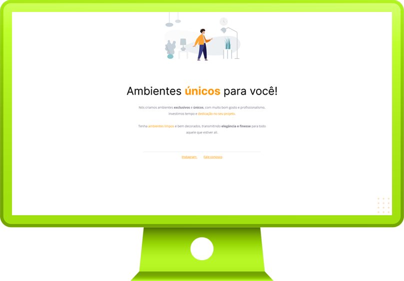

 
 

 
 

 

Rocketsear Explorer is the second-level course, preceded by Rocketseat Discover, that works in getting us more steps into development. I have started this course by doing some of their projects, and then realized I was skipping Rocketseat Discover: right now, I'm studying Discover. I will be back as soon as I finish it!

##### O curso Explorer, da Rocketseat, é curso de segundo nível, posterior ao Discover, que tem o intuito de avançar ainda mais na área de desenvolvimento. Eu iniciei esse curso e fiz alguns projetos, e então percebi a existência do Discover: nesse momento, eu retornei e iniciei o Discover. Quando terminá-lo, retorno para o Explorer!

 
 
 
 

 

 
 
 
 

 

|         |             |    
| :-------------:|:-------------:|
|  |   |
| **Project #01:** Simple Landing Page   | **Project #02:** Simple Landing Page  
| **Code:** [📄](https://github.com/malunaridev/Course-Rocketseat-Explorer/tree/master/projects/project-01) \| **Live Preview:** [🌐](https://rocketseat-explorer-01.vercel.app/) | **Code:** [📄](https://github.com/malunaridev/Course-Rocketseat-Explorer/tree/master/projects/project-02) \| **Live Preview:** [🌐](https://rocketseat-explorer-02.vercel.app/) 

 
 
 
 

 

|  Topic       |  Content        |  Done        |
| ------------------ | ------------------ | :--------------------------------------------: |
|  Intro      | HTTP, URLs, TCP, IP, Proxy, browsers, MAC Adress, DNS, hardware, software |  |
|  HTML      | SEO, tables, meta, social meta, favicon |  |
|  More updates soon!      |  |  |

 
 
 
 
 

