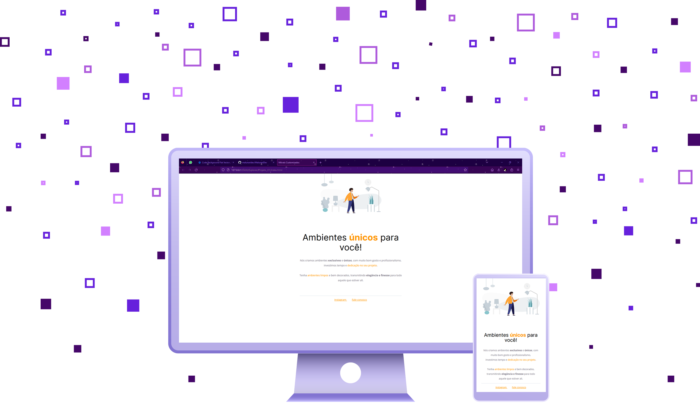

### Links

- Original project: [Figma](https://www.figma.com/file/Y71R8Jb1ydkc5ebrqoaF02/Explorer---Projeto-01-(Copy))
- Live Site URL: [URL](https://rocketseat-explorer-01.vercel.app/)

---
:brazil:

# Rocketseat Explorer - Projeto #01

Este foi o meu primeiro projeto, construído passo a passo, seguindo as dicas dadas pelo mentor do curso. É um layout bastante simples por enquanto, mas, já que eu ainda tenho uma longa jornada para seguir, parece ter sido um bom ponto de partida.

## O processo

### Construído com

- HTML
- CSS

### O que aprendi

Como meu primeiro projeto, eu realmente apreciei a sensação de assistir o que estava sendo construído, código a código. Como um projeto simples e pequeno, mas com grande potencial, eu pude enxergar uma infinidade de coisas que eu ainda posso construir no futuro.

---
:earth_americas:

# Rocketseat Explorer - Project #01

This was my first project, built step by step by following tips given by the mentor. It looks very simple and clean for now, but since I still have a long journey ahead, I think it is a good starting point.

## My Process

### Built with

- HTML
- CSS

### What I learned

As my first project, I really enjoyed the feeling of watching what I was buiding, code by code, and as a simple project but with great potential, I could realize how many other things I will make in the future.

## Author

- GitHub - [MalunariDev](https://github.com/malunaridev)
- CodePen - [MalunariDev](https://codepen.io/MalunariDev)
- Linkedin - [MalunariDev](https://www.linkedin.com/in/malunaridev/)

