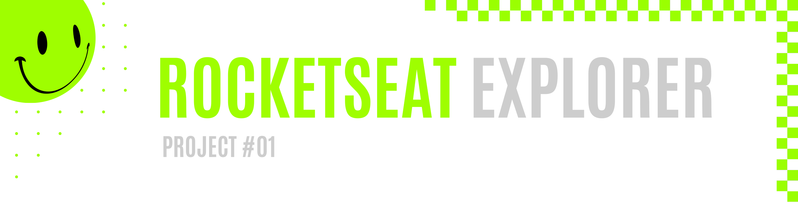
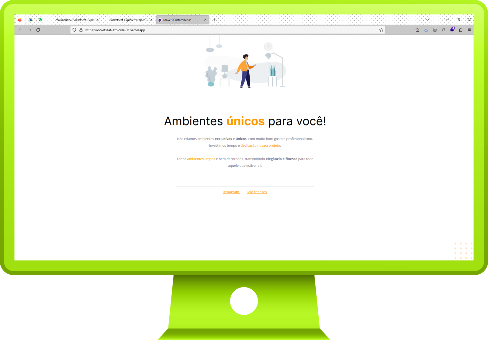

 
 

|         |               
| :-------------:|
|   |
| **Project #01:** Simple Landing Page   | 
| **Original Project:** [🌐](https://www.figma.com/file/Y71R8Jb1ydkc5ebrqoaF02/Explorer---Projeto-01-(Copy)) / **My Code:** [📄](https://github.com/malunaridev/Rocketseat-Explorer/tree/master/project-01) / **Live Preview:** [🌐](https://rocketseat-explorer-01.vercel.app/)  

 
 

This was my first project, built step by step as I was following the process explained by the mentor. It looks very simple and clean for now, but since I still have a long journey ahead, I think it is a good starting point. I can always come back later to apply more features to this when I learn more of it.

 
 
 

- HTML
- CSS

 
 
 

As my first project, I really enjoyed the feeling of watching what I was buiding, code by code, and as a simple project but with great potential, I could realize how many other things I will make in the future.

 
 
 

