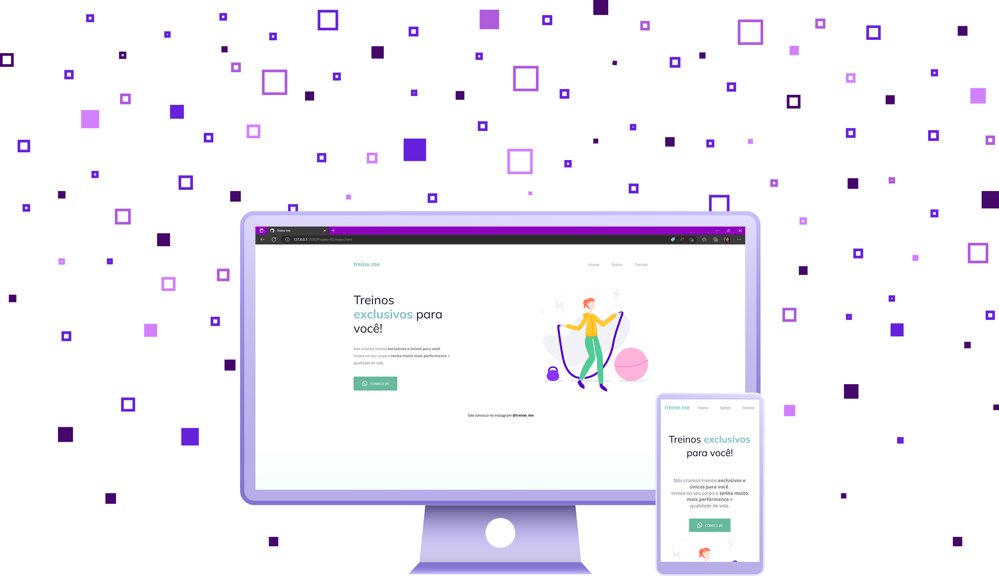

### Links

- Original project: [Figma](https://www.figma.com/file/7d4pktWzEybtrlWkYam4D4/Explorer---Projeto-02-(Copy)?node-id=1%3A5&t=JZjAU0kbBnHsI6HP-0)
- Live Site URL: [URL](https://rocketseat-explorer-02.vercel.app/)

---
:brazil:

# Rocketseat Explorer - Projeto #02

O segundo projeto que construí, também de acordo com as dicas dadas pelo mentor do curso, foi um pouquinho mais desafiador que o primeiro, já entrando em conceitos importantes sobre posicionamento e hover.

## O processo

### Construído com

- HTML
- CSS

### O que aprendi

Foi bastante interessante ter este primeiro contato com a organização estrutural de uma página, na forma mais simples possível, utilizando o `display:flex`. 

---
:earth_americas:

# Rocketseat Explorer - Project #02

The second project I built, also following structions given by the mentor, was a little bit more challenging than the first one, as I was presented to important concepts like positioning and hover.

## My Process

### Built with

- HTML
- CSS

### What I learned

It was really interesting to have this first contac with the page structure, in it's most simple form, using `display:flex`. 

## Author

- GitHub - [MalunariDev](https://github.com/malunaridev)
- CodePen - [MalunariDev](https://codepen.io/MalunariDev)
- Linkedin - [MalunariDev](https://www.linkedin.com/in/malunaridev/)

