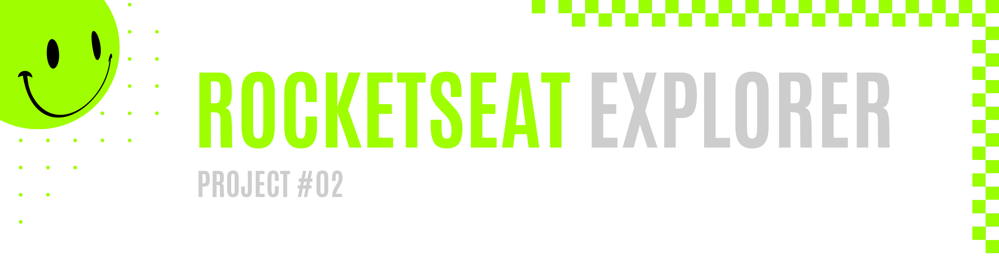
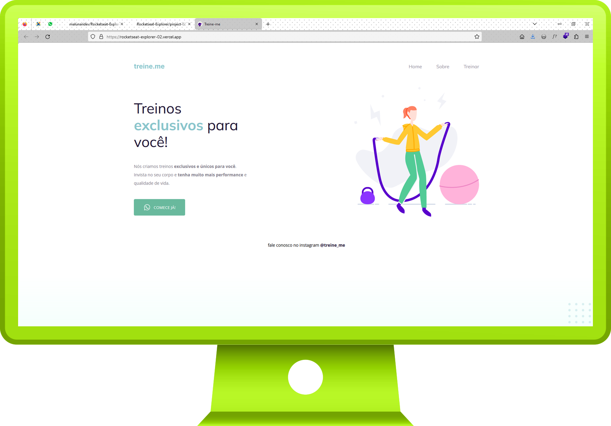

 
 

|         |               
| :-------------:|
|   |
| **Project #02:** Simple Landing Page   | 
| **Original Project:** [🌐](https://www.figma.com/file/7d4pktWzEybtrlWkYam4D4/Explorer---Projeto-02-(Copy)?node-id=1%3A5&t=JZjAU0kbBnHsI6HP-0) / **My Code:** [📄](https://github.com/malunaridev/Rocketseat-Explorer/tree/master/project-02) / **Live Preview:** [🌐](https://rocketseat-explorer-02.vercel.app/)  

 
 

The second project that I have built, also following orientations given by the mentor, was a little bit more challenging than the first one, as I was presented to important concepts like positioning.

 
 
 

- HTML
- CSS

 
 
 

It was really interesting to have this first contact with the page structure, in it's most simple form, using `display:flex`. 

 
 
 

